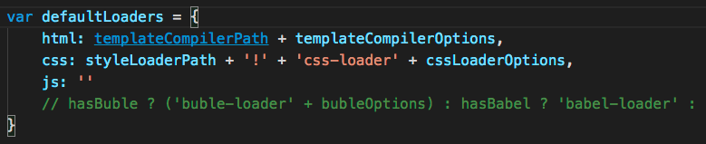
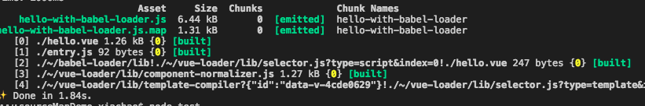
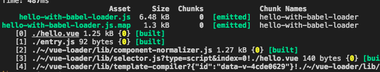

# this is an issue repo
### for note sourceMap mapping incorrectly on babel-loader

### i already create two folders 
* bak folder --> sourceMap without babel-loader
* build folder --> sourceMap with babel-loader

## test.js
this file test the sourceMap is or not correct

##
node test.js
> this operation will test the sourceMap with babel-loader
you can see the result is null
##
node bak/test.js
> this operation will test the sourceMap without 
babel-loader

you can see the result is correct

## how to create sourceMap without babel-loader
* npm install yarn -g
* yarn install
* in node_modules ,then find vue-loader/lib/loader.js  about line:90

* yarn go

## webpack bundles-- with babel-loader

this situation, the result is in build folder

## webpack bundles-- without babel-loader

this situation, the result is in bak folder